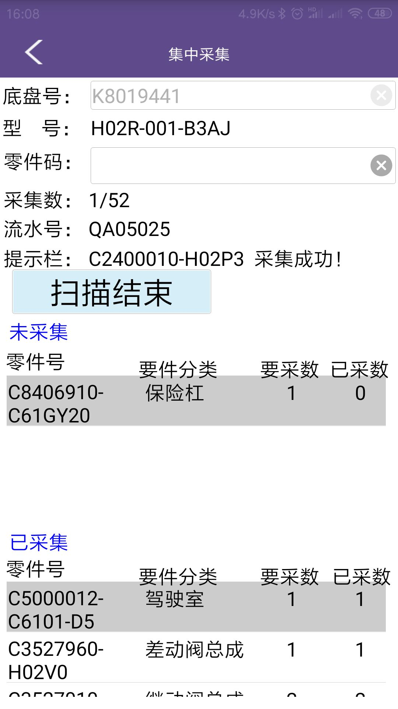

## 重保件采集

[TOC]

### 1. 采集主程序界面



### 2. 重保件采集程序主逻辑

`JYW$DEAL$INPUT_FN_DEAL_JYW_INPUT_CTR`  ：条码格式化（多段条码统一格式输出）入口函数
`DFL$SM$DEL.DFL_SM_DEL_CTR` ：装配线采集入口函数
`DFL$SM$DEL_FZQ.DFL_SM_DEL_CTR` ：分装区采集入口函数


### 3. 重保件采集程序涉及表

```sql
--上游数据表
SELECT T.*,T.ROWID FROM compsetinfo t ; --物料主数据表

SELECT T.*,T.ROWID FROM imptcomptype t ; --要件分类表

--零件校验表
SELECT T.*,T.ROWID FROM vinimptcomp t ; --要件展开表

--是否启用版本控制
SELECT --NVL(MAX(I.VERMARK), '')--, I.*
 VERMARK, I.*, I.ROWID
  FROM IMPTCOMPTYPE I
 WHERE SETZONENO = 'C'
   AND I.IMPTTYPENO = 'A'; --* 启用， 空 不启用

--校验位表
SELECT T.*, T.ROWID FROM GYS_DK_LJ_BB T ; --接收上游发送数据表

--采集结果存放表
SELECT T.*,T.ROWID FROM qimptcomp t ; --装配线采集结果表

SELECT T.*,T.ROWID FROM qimptcomp_fz t ; --分装区采集结果表


```


### 4. 常见问题：

#### 4.1 重保件采集提示信息包含“校验位未报备”：

该表`GYS_DK_LJ_BB`数据使用过后，自动把`GYS_DK_LJ_BB.USEFLAG`打上`'!'`标记。

```sql

--如果查询为0行，则表示校验位未报备
SELECT T.*, T.ROWID
  FROM GYS_DK_LJ_BB T
 WHERE T.ID = '17H23NHZ' --校验位，8段零件二维码最后一段
   AND T.VENDORNO = '5811' --厂商代码，8段零件二维码第一段
   AND T.USEFLAG = '*';

```

#### 4.2 重保件采集提示信息包含“版本号不匹配”：

```sql
--如果查询为0行，则表示版本号不匹配
SELECT *
  FROM V_BOMTOMES_CODITMENGC$ T
 WHERE T.MEITEM = '5000012-C4338-AP' --零件号，8段零件二维码第二段
   AND T.MEIMAK = '02' --零件版本号，8段零件二维码第三段
   AND T.MEAXFGDT <= '20200430' --BOM日期，PRODPLAN.BOMDAY
   AND T.MEDXFGDT >= '20200430'; --BOM日期，PRODPLAN.BOMDAY; 
```


#### 4.3 重保件采集提示信息包含“零件号错误”：

检查要件展开表是否有对应零件号。

```sql
SELECT T.*, T.ROWID
  FROM VINIMPTCOMP T
 WHERE LINENO = ''
   AND VIN = '';
```

